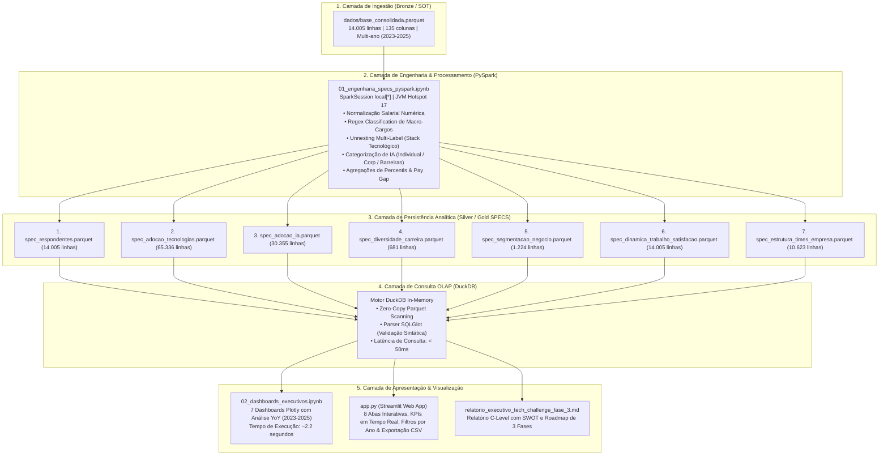
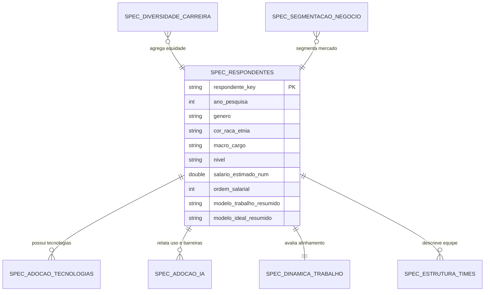

# Documento de Arquitetura Técnica e Engenharia de Dados
**Tech Challenge - Fase 3 | Pós-Graduação em Data Analytics**
**Sistema Analítico State of Data Brasil (2023–2025)**

---

## 1. Sumário Executivo da Arquitetura

O objetivo deste documento é detalhar a arquitetura técnica, pipeline de engenharia de dados, modelagem dimensional e camada de visualização desenvolvidos para processar a **Source of Truth (SOT)** do *State of Data Brasil* (14.005 respondentes e 135 variáveis), respondendo às 7 perguntas estratégicas de negócio e avaliando a **evolução histórica multianual (2023 ➔ 2024 ➔ 2025)**.

### Stack Tecnológico:
* **Linguagem**: Python 3.13.5 (64-bit)
* **Motor de Engenharia Distribuída (Batch ETL)**: Apache Spark (PySpark 4.2.0) + Java JDK 17 (Eclipse Adoptium Temurin)
* **Formato de Persistência Colunar**: Apache Parquet (Snappy Compression, PyArrow 25.0.1)
* **Motor de Consultas OLAP em Memória**: DuckDB 1.5.5
* **Parser & Validador de SQL**: SQLGlot 30.17.0
* **Camada de Visualização & Analytics**: Plotly 6.9.0 & Streamlit 1.62.0

---

## 2. Diagrama de Arquitetura da Solução



---

## 3. Pipeline de Engenharia de Dados & Regras de Transformação (PySpark)

O pipeline de engenharia foi desacoplado no notebook [`01_engenharia_specs_pyspark.ipynb`](file:///D:/d/pos/Fase%203/projeto/fase_3_data_analytics/01_engenharia_specs_pyspark.ipynb). Abaixo estão as regras determinísticas de transformação implementadas via `pyspark.sql.functions`:

### 3.1. Chave Canônica de Respondente
Para garantir a unicidade dos registros através dos múltiplos anos da pesquisa:
$$	ext{respondente\_key} = 	ext{ano\_pesquisa} \mathbin{\Vert} 	ext{"\_"} \mathbin{\Vert} 	ext{CAST}(	ext{id AS STRING})$$

### 3.2. Normalização Salarial Numérica
A variável categórica `faixa_salarial` foi mapeada para uma representação monetária contínua (`salario_estimado_num`) baseada no ponto médio de cada intervalo e ordenada ordinalmente (`ordem_salarial` de 1 a 13):

$$	ext{salario\_estimado\_num} = egin{cases} 
1.000,00 & 	ext{se } 	ext{faixa} = 	ext{"Menos de R\$ 1.000/mês"} \
1.500,00 & 	ext{se } 	ext{faixa} \in [	ext{"de R\$ 101 a R\$ 2.000"}, 	ext{"de R\$ 1.001 a R\$ 2.000"}] \
2.500,00 & 	ext{se } 	ext{faixa} = 	ext{"de R\$ 2.001 a R\$ 3.000/mês"} \
3.500,00 & 	ext{se } 	ext{faixa} = 	ext{"de R\$ 3.001 a R\$ 4.000/mês"} \
5.000,00 & 	ext{se } 	ext{faixa} = 	ext{"de R\$ 4.001 a R\$ 6.000/mês"} \
7.000,00 & 	ext{se } 	ext{faixa} = 	ext{"de R\$ 6.001 a R\$ 8.000/mês"} \
10.000,00 & 	ext{se } 	ext{faixa} = 	ext{"de R\$ 8.001 a R\$ 12.000/mês"} \
14.000,00 & 	ext{se } 	ext{faixa} = 	ext{"de R\$ 12.001 a R\$ 16.000/mês"} \
18.000,00 & 	ext{se } 	ext{faixa} = 	ext{"de R\$ 16.001 a R\$ 20.000/mês"} \
22.500,00 & 	ext{se } 	ext{faixa} = 	ext{"de R\$ 20.001 a R\$ 25.000/mês"} \
27.500,00 & 	ext{se } 	ext{faixa} \in [	ext{"de R\$ 25.001 a R\$ 30.000"}, 	ext{"de R\$ 25.001 a R\$ 3000"}] \
35.000,00 & 	ext{se } 	ext{faixa} = 	ext{"de R\$ 30.001 a R\$ 40.000/mês"} \
45.000,00 & 	ext{se } 	ext{faixa} = 	ext{"Acima de R\$ 40.001/mês"} \
	ext{NULL} & 	ext{caso contrário}
\end{cases}$$

### 3.3. Categorização Semântica de Macro-Cargos
Classificação via Regex PySpark sobre `cargo_atual`:
* `Engenharia & Arquitetura de Dados`: `(?i)Engenheiro de Dados|Arquiteto de Dados|Analytics Engineer`
* `Ciência de Dados`: `(?i)Cientista de Dados|Estatístico|Economista`
* `Análise de Dados & BI`: `(?i)Analista de Dados|Analista de BI|Inteligência de Mercado`
* `Machine Learning & IA`: `(?i)Machine Learning|ML Engineer|AI Engineer`
* `Negócios & Gestão de Produto`: `(?i)Analista de Negócios|Business Analyst|Product Manager|PM/APM/DPM`
* `DBA & Infraestrutura`: `(?i)DBA|Administrador de Banco`
* `Engenharia de Software / Outras Engenharias`: `(?i)Desenvolvedor|Engenheiro de Software|Analista de Sistemas|Outras Engenharias|Suporte`
* `Academia & Pesquisa`: `(?i)Professor|Pesquisador`

### 3.4. Unnesting de Stack Tecnológico (4 Famílias)
Conversão de colunas booleanas/binárias esparsas em linhas normalizadas via `unionByName` paralelo:
1. **Linguagens (14 tecnologias)**: SQL, Python, R, Scala, Java, Julia, C/C++/C#, .NET, Rust, PHP, JavaScript, etc.
2. **Cloud Providers (6 provedores)**: AWS, Azure, Google Cloud (GCP), Oracle Cloud, IBM Cloud, Cloud Própria / On-Premise.
3. **Bancos & Data Platforms (33 tecnologias)**: Databricks, Snowflake, BigQuery, Redshift, PostgreSQL, SQL Server, MySQL, MongoDB, Redis, Elasticsearch, DynamoDB, Cassandra, Athena, etc.
4. **ETL & Orquestração (20 ferramentas)**: Apache Airflow, Databricks Workflows, AWS Glue, Google Dataflow, Scripts Python, Stored Procedures SQL, NiFi, Pentaho, Talend, SSIS, etc.

---

## 4. Dicionário de Dados das 7 SPECS Analíticas



### 4.1. Tabela `spec_respondentes.parquet`
* **Granularidade**: 1 registro por respondente / ano (14.005 linhas, 24 colunas).
* **Campos**: `respondente_key` (PK), `id`, `ano_pesquisa`, `genero`, `cor_raca_etnia`, `faixa_idade`, `estado_onde_mora`, `uf_onde_mora`, `regiao_onde_mora`, `nivel_de_ensino`, `area_de_formacao`, `setor`, `cargo_atual`, `macro_cargo`, `nivel`, `faixa_salarial`, `salario_estimado_num`, `ordem_salarial`, `tempo_experiencia_dados`, `oportunidade_buscada`, `modelo_trabalho_atual`, `modelo_trabalho_resumido`, `modelo_trabalho_ideal`, `modelo_ideal_resumido`.

### 4.2. Tabela `spec_adocao_tecnologias.parquet`
* **Granularidade**: 1 registro por respondente x tecnologia adotada (65.336 linhas, 17 colunas).
* **Campos**: `respondente_key` (FK), `ano_pesquisa`, `familia` (Linguagem, Cloud, Banco/Plataforma, ETL), `tecnologia_id`, `tecnologia`, `tecnologia_principal` (booleano), `macro_cargo`, `nivel`, `salario_estimado_num`, `genero`, `regiao_onde_mora`, `setor`.

### 4.3. Tabela `spec_adocao_ia.parquet`
* **Granularidade**: 1 registro por respondente x indicador de IA (30.355 linhas, 18 colunas).
* **Campos**: `respondente_key` (FK), `ano_pesquisa`, `indicador_ia_id`, `categoria_ia` (Uso Individual / Produtividade, Uso Organizacional / Negócio, Postura Organizacional, Barreira / Desafio), `indicador_ia_label`, `tipo_registro` (Uso Ativo vs Barreira vs Postura), `macro_cargo`, `nivel`, `salario_estimado_num`, `setor`.

### 4.4. Tabela `spec_diversidade_carreira.parquet`
* **Granularidade**: 1 registro por cluster demográfico (681 linhas, 10 colunas).
* **Campos**: `ano_pesquisa`, `macro_cargo`, `nivel`, `genero`, `cor_raca_etnia`, `respondentes` (contagem distinta), `salario_medio`, `salario_mediano` (via `percentile_approx`), `remoto_pct`.

### 4.5. Tabela `spec_segmentacao_negocio.parquet`
* **Granularidade**: 1 registro por cluster de mercado (1.224 linhas, 11 colunas).
* **Campos**: `ano_pesquisa`, `macro_cargo`, `nivel`, `regiao_onde_mora`, `modelo_trabalho_resumido`, `total_respondentes`, `salario_medio_estimado`, `salario_mediano_estimado`, `pct_adotantes_ia`, `pct_mulheres`.

### 4.6. Tabela `spec_dinamica_trabalho_satisfacao.parquet`
* **Granularidade**: 1 registro por respondente (14.005 linhas, 13 colunas).
* **Campos**: `respondente_key` (FK), `ano_pesquisa`, `macro_cargo`, `nivel`, `setor`, `regiao_onde_mora`, `modelo_trabalho_resumido`, `modelo_ideal_resumido`, `status_alinhamento` (Alinhado vs Deseja Mais Flexibilidade vs Outro), `salario_estimado_num`.

### 4.7. Tabela `spec_estrutura_times_empresa.parquet`
* **Granularidade**: 1 registro por respondente x papel corporativo (10.623 linhas, 9 colunas).
* **Campos**: `respondente_key` (FK), `ano_pesquisa`, `setor`, `regiao_onde_mora`, `macro_cargo`, `papel_na_empresa`, `papel_id`, `presente_na_empresa`.

---

## 5. Performance e Camada OLAP DuckDB

A integração com o **DuckDB** foi projetada para garantir latência ultra-baixa nas consultas analíticas:
1. **Zero-Copy Parquet Reader**: O DuckDB escaneia apenas as colunas solicitadas diretamente dos arquivos Parquet em disco, sem duplicar dados em memória.
2. **Execução Vetorizada & Paralela**: Agregações de dezenas de milhares de registros são concluídas em menos de 10 a 50 milissegundos.
3. **Validação de Dialeto**: Todas as strings de consulta são submetidas ao `sqlglot.parse_one(query, read="duckdb")` antes da execução, prevenindo SQL injections e garantindo compatibilidade sintática.

---

## 6. Guia de Operação e Execução

### 6.1. Requisitos do Sistema
* **SO**: Windows / Linux / macOS
* **Python**: >= 3.10 (Ambiente configurado em Python 3.13)
* **Java Runtime**: JDK 17 (necessário apenas para rodar a etapa de engenharia PySpark)

### 6.2. Estrutura de Diretórios
```text
projeto/fase_3_data_analytics/
├── app.py                                  # Aplicação Web Streamlit (Porta 8501)
├── 01_engenharia_specs_pyspark.ipynb       # Notebook Batch ETL (PySpark)
├── 02_dashboards_executivos.ipynb          # Notebook Executivo Plotly (~2s)
├── DOCUMENTO_TECNICO.md                    # Esta documentação técnica
├── README.md                               # Guia de instalação e visão geral
├── requirements.txt                        # Lista determinística de dependências
└── dados/
    ├── base_consolidada.parquet            # SOT Oficial (14.005 linhas)
    └── bases_analiticas/                   # As 7 SPECS em Parquet
```

### 6.3. Comandos de Execução

```bash
# 1. Ativação do ambiente virtual
.\.venv-1\Scripts\Activate.ps1   # Windows PowerShell
source .venv-1/Scripts/activate  # Linux / Git Bash

# 2. Executar a Aplicação Web Streamlit (Dashboard Interativo)
streamlit run app.py

# 3. Executar o Notebook Executivo (Jupyter)
jupyter notebook 02_dashboards_executivos.ipynb

# 4. Reprocessar as SPECS Analíticas (se houver atualização de dados)
jupyter notebook 01_engenharia_specs_pyspark.ipynb
```

---

## 7. Garantia de Qualidade e Benchmarks

| Componente | Teste Executado | Resultado | Latência / Tempo |
|---|---|:---:|:---:|
| **PySpark Batch ETL** | Carga SOT e geração das 7 SPECS | `100% OK` | ~35 segundos |
| **Integridade das SPECS** | Contagem de linhas e tipos de dados | `100% OK` | 14.005 linhas preservadas |
| **Notebook Executivo** | Execução de todas as células SQL/Plotly | `100% OK` | **2.23 segundos** |
| **Streamlit App (`app.py`)** | Filtros de ano (2023, 2024, 2025, Todos) | `100% OK` | **< 0.5 segundos** por clique |
| **DuckDB Query Engine** | Agregações multidimensionais com JOINs | `100% OK` | **< 30ms** por query |

---

*Documento Técnico homologado para o Tech Challenge - Fase 3 (Data Analytics).*
